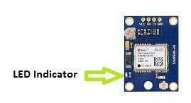
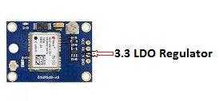
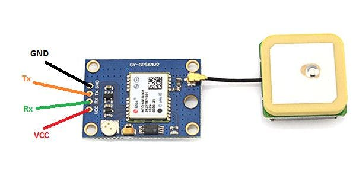
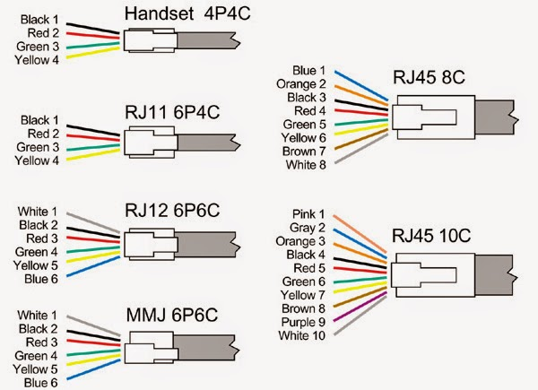
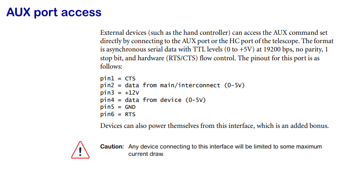
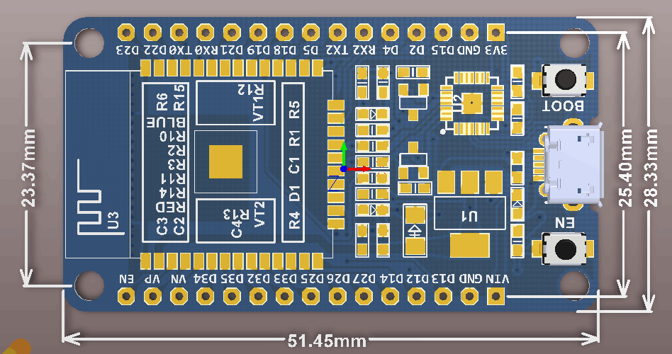

NexStarGPS
==========

Uses TinyGPS from http://arduiniana.org/libraries/tinygps/ as GPS provider.

Uses customized versions of SoftwareSerial and SendOnlySoftwareSerial libraries.

Does not use CTS/RTS pins since they are not used on NexStar 5SE.

> CTS/RTS are 2 of the 4 serial pins. They are old school and not used anymore, which is probably why they have been repurposed.

 CTS is always 3V, RTS is always 12V (!). Commonly available 4-wire telephone cables can be used to connect GPS unit to telescope (but you need 6p6c plug on telescope side anyway, just do not connect pins 1 and 6)

**Also 5SE has TX and RX pins shortcutted so relatively weird logic with two software serial instances (one for TX, another for RX) is used to allow telescope firmware to work properly.**

Without the work of Andre Paquette you find at http://www.paquettefamily.ca/nexstar/NexStar_AUX_Commands_10.pdf this library would have been impossible. Andre you rock!

Licence
=======
Copyright 2014 Thomas Peuss <thomas at peuss dot de>

Copyright 2015 Andrew Evdokimovi <at iflyhigh dot ru>

This library is free software; you can redistribute it and/or
modify it under the terms of the GNU Lesser General Public
License as published by the Free Software Foundation; either
version 2.1 of the License, or (at your option) any later version.

This library is distributed in the hope that it will be useful,
but WITHOUT ANY WARRANTY; without even the implied warranty of
MERCHANTABILITY or FITNESS FOR A PARTICULAR PURPOSE.  See the GNU
Lesser General Public License for more details.

You should have received a copy of the GNU Lesser General Public
License along with this library; if not, write to the Free Software
Foundation, Inc., 51 Franklin St, Fifth Floor, Boston, MA  02110-1301  USA

DrMikeG
=======

## 23rd May 2020 ##

Back in 2017, I used this library and instructions to make a compatible GPS unit for my celestron 127SLT.
And amazingly, it worked, and I didn't brick my telescope.

However it recently developed a fault, so now I have an opportunity (and a week of annual leave in isolation with the kids) in which I can try again and hopefully do a better job.

I plan to use an esp32 rather than an arduino nano this time - which will hopefully allow me to check the status of the unit via a webpage.

I also plan to use a proper power convertor this time, not something I pulled from a cigarette lighter adaptor.

### Notes from 2010 ###

> GY-NEO6MV2
> 
> http://arduinostuff.blogspot.be/2014/05/neo6mv2-gps-module-with-arduino-uno-how.html
XCSOURCE GPS NEO-6M Module Aircraft Flight Controller For Arduino MWC IMU APM2 TE237
1.3" SPI I2C IIC 128X64 OLED LCD LED Display Module Board For Arduino UNO R3 STM
Adafruit ssd1306 - https://github.com/adafruit/Adafruit_SSD1306 & Adafruit-gfx
0x3C address?
https://www.youtube.com/watch?v=VEZGn0zYHiE
> 
> 
> http://www.nexstarsite.com/OddsNEnds/PortsSLT.htm
>
> Working Nano Pin out
>
> TX has a resistor, voltage divider to reduce 5v down to 3 - connected to RX on GPS
>
> RX connects to TX on GPS (resistor pullup to 5v)
>
> Pin D3 connects to mount yellow wire
>
> Pin D5 connects to mount brown wire
>
> Pin 9 is LED+
> 
> http://www.cloudynights.com/topic/515804-nexstar-starsense-skysync-wrong-datetimelocation/

# Components I am using this time around #

## GPS ##
GY-NEO6MV2 NEO-6M Ublox Flight Controller GPS Module For Arduino Raspberry Pi

Features:
Power supply: 3V-5V
Models: GY - GPS6MV2
Module with ceramic antenna, signal strong
EEPROM save the configuration parameter data when power down
With data backup battery
The LED signal lights
The default baud rate: 9600
Compatible with various flight control modules
Module size 25 x 35 mm  (0.98'' x 1.37'')
Antenna size: 25 x 25 mm  (0.98''x 0.98'')


Tutorial for Raspberry Pi with Python
http://www.instructables.com/id/Raspberry-Pi-the-Neo-6M-GPS/

Package Content: 1 x GY-NEO6MV2 GPS Module 

Product ID: EP018

| Neo-6M     | RPI    |
| --------|---------|
| VCC  | Pin 1  (3.3v)  |
| TX | Pin 10, which is RX (GPIO15) |
| RX | Pin 8, Which is TX (GPIO14) |
| Gnd | Pin 6, which is Gnd |

https://create.arduino.cc/projecthub/ruchir1674/how-to-interface-arduino-mega-with-neo-6m-gps-module-1b7283

### Overview of NEO-6M GPS Module ###

NEO-6M GPS Chip
The heart of the module is a NEO-6M GPS chip from u-blox. It can track up to 22 satellites on 50 channels and achieves the industry’s highest level of sensitivity i.e. -161 dB tracking, while consuming only 45mA supply current. The u-blox 6 positioning engine also boasts a Time-To-First-Fix (TTFF) of under 1 second. One of the best features the chip provides is Power Save Mode(PSM). It allows a reduction in system power consumption by selectively switching parts of the receiver ON and OFF. This dramatically reduces power consumption of the module to just 11mA making it suitable for power sensitive applications like GPS wristwatch. The necessary data pins of NEO-6M GPS chip are broken out to a "0.1″ pitch headers. This includes pins required for communication with a microcontroller over UART.

Note:- The module supports baud rate from 4800bps to 230400bps with default baud of 9600.

### Position Fix LED Indicator ###

There is an LED on the NEO-6M GPS Module which indicates the status of Position Fix. It’ll blink at various rates depending on what state it’s in

No Blinking ==> means It is searching for satellites
Blink every 1s – means Position Fix is found



3.3V LDO Regulator
The operating voltage of the NEO-6M chip is from 2.7 to 3.6V. But, the module comes with MIC5205 ultra-low dropout 3V3 regulator from MICREL. The logic pins are also 5-volt tolerant, so we can easily connect it to an Arduino or any 5V logic microcontroller without using any logic level converter.



Battery & EEPROM

The module is equipped with an HK24C32 two wire serial EEPROM. It is 4KB in size and connected to the NEO-6M chip via I2C.The module also contains a rechargeable button battery which acts as a super-capacitor.

An EEPROM together with battery helps retain the battery backed RAM (BBR). The BBR contains clock data, latest position data (GNSS or bit data) and module configuration. But it is not meant for permanent data storage.

As the battery retains clock and last position, time to first fix (TTFF) significantly reduces to 1s. This allows much faster position locks.

Without the battery the GPS always cold-start so the initial GPS lock takes more time. The battery is automatically charged when power is applied and maintains data for up to two weeks without power.

Pinout



> GND is the Ground Pin and needs to be connected to GND pin on the Arduino.
> 
> TxD (Transmitter) pin is used for serial communication.
>
> RxD (Receiver) pin is used for serial communication.
>
> VCC supplies power for the module. You can directly connect it to the 5V pin on the Arduino.

## Cable ##
6P6C RJ12 - RJ12 DATA LEAD CABLE - LENGTHS 1m






## Power ##
MP1584 Mini DC-DC Buck Converter Step Down Module, like LM2596

https://www.hotmcu.com/mp1584-buck-step-down-3a-adjustable-regulator-module-p-82.html


## ESP ##
5pcs ESP-WROOM-32 ESP32 ESP32S 2.4GHz WiFi Bluetooth Development Board Arduino

ESP32 is already integrated antenna and RF balun, power amplifier, low-noise amplifiers, filters, 

and power management module. The entire solution takes up the least amount of printed circuit board area.
This board is used with 2.4 GHz dual-mode Wi-Fi and Bluetooth chips by TSMC 40nm low power technology,
power and RF properties best, which is safe, reliable, and scalable to a variety of applications.

Features:

High performance-price ratio
Small volume, easily embeded to other products
Strong function with support LWIP protocol, Freertos
Supporting three modes: AP, STA, and AP+STA
Supporting Lua program, easily to develop
Development Board: https://github.com/Nicholas3388/LuaNode 




https://circuits4you.com/2018/12/31/esp32-hardware-serial2-example/

There are three serial ports on the ESP32 known as U0UXD, U1UXD and U2UXD all work at 3.3V TTL Level. There are three hardware supported serial interfaces on the ESP32 known as UART0, UART1 and UART2. 


https://randomnerdtutorials.com/getting-started-with-esp32/


```/*
 * There are three serial ports on the ESP known as U0UXD, U1UXD and U2UXD.
 * 
 * U0UXD is used to communicate with the ESP32 for programming and during reset/boot.
 * U1UXD is unused and can be used for your projects. Some boards use this port for SPI Flash access though
 * U2UXD is unused and can be used for your projects.
 * 
*/
 
#define RXD2 16
#define TXD2 17
 
void setup() {
  // Note the format for setting a serial port is as follows: Serial2.begin(baud-rate, protocol, RX pin, TX pin);
  Serial.begin(115200);
  //Serial1.begin(9600, SERIAL_8N1, RXD2, TXD2);
  Serial2.begin(9600, SERIAL_8N1, RXD2, TXD2);
  Serial.println("Serial Txd is on pin: "+String(TX));
  Serial.println("Serial Rxd is on pin: "+String(RX));
}
 
void loop() { //Choose Serial1 or Serial2 as required
  while (Serial2.available()) {
    Serial.print(char(Serial2.read()));
  }
} 
```

This program reads data from serial2 and sends to serial0 i.e. programming serial. Multiple serial is useful when using GPS and GSM systems together.

The video on this site shows how use 3 serial connections on an esp32 board.
https://hackaday.com/2017/08/17/secret-serial-port-for-arduinoesp32/

This would allow a progamming connection, and GPS connection and a telescope connection.

Put the GPS on the 'secret one' so we can check it works. Pretty confident serial 2 will work - connect that to telescope lead.

## Software serial ##
I don't know whether the hardware serial is neccessary. The comment at the top
> **Also 5SE has TX and RX pins shortcutted so relatively weird logic with two software serial instances (one for TX, another for RX) is used to allow telescope firmware to work properly.**

suggests that splitting send and receive is neccessary?

``` #define RX_PIN 3
#define TX_PIN 5

ross mountserial(RX_PIN);
soss sendmountserial(TX_PIN);
```

Probably better start with software serial.


## 25th May 2020 ##

When powered from USB, what is the output from VIN? 5V

Can I power the GPS chip from this?
A) When running from USB?
4.6v measured gnd/vin
B) When running from another power source? (Pull this to 5V)?

I wanted to test the programming of the ESP board and the wiring of the GPS module.

I used the TinyGPSPlusPlus KitchenSink01 example installed in CelestronGPSBase repo.
It required modification for the board - changing the pins to D13 and D12 which are handly right next to power and gnd.

static const int RXPin = 13, TXPin = 12;

static const uint32_t GPSBaud = 9600;

// The serial connection to the GPS device
SoftwareSerial ss(RXPin, TXPin);

Blue wire to esp pin 12
purple wire to esp pin 13
programmed as esp32 dev module

 9:29:36.275 -> TIME       Fix Age=2ms Raw=18293900 Hour=18 Minute=29 Second=39 Hundredths=0
19:29:36.275 -> ALTITUDE   Fix Age=8ms Raw=-2460 Meters=-24.60 Miles=-0.02 KM=-0.02 Feet=-80.71
19:29:36.275 -> SATELLITES Fix Age=15ms Value=4
19:29:36.275 -> HDOP       Fix Age=18ms Value=594
19:29:37.138 -> LOCATION   Fix Age=0ms Raw Lat=+52[+313470833 billionths],  Raw Long=+0[+21190000 billionths],  Lat=52.313471 Long=0.021190

Next step? To think about the telescope connection.

The black cable on my 2017 version is colour

looking at the plug, wiring going out to the right
 

   ________
 1| white  |     | CTS
 2| brown  | D5  | data from main
 3| green  | 12v | +12V
 4| yellow | D3  | data from device
 5| pink   | gnd | gnd
 6| black  |     | RTS
  ---------

  > CTS is always 3V, RTS is always 12V (!).

My new white cable colouring is

1| RED    |
2| BLUE   | D5
3| WHITE  | 12v
4| BROWN  | D3
5| GREEN  | gnd
6| YELLOW |

Will the telescope work with 3V logic, that's the question?

Probably better test this before I get too wrapped up in the webpage side of things...

Then there is the power supply question, 500ma peak pull down this bell wire?

--- 

Hmm, so ross.cpp does not compile because it has avr specific includes.
I am trying to figure out if I can use software serial however, since that does compile for ESP32...

But now I have pins coming out my ears....